# MOA – Visión y Pasos Clave

Apertura

- Backend (Express + PostgreSQL)
- Frontend (React + Vite)
- Shared (utilidades comunes)
- Objetivo: ver cómo fluye la info y cómo se implementan filtros, layouts y UX prácticas.

---

## Mapa de flujo Admin

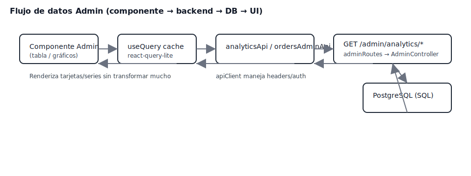

Notas:
- Componentes piden datos vía servicios (`analyticsApi`, `ordersAdminApi`).
- Rutas `/admin/*` protegidas por `verifyAdmin`.
- Controladores devuelven datos listos para mostrar.

---

## Filtros en cliente (Products)

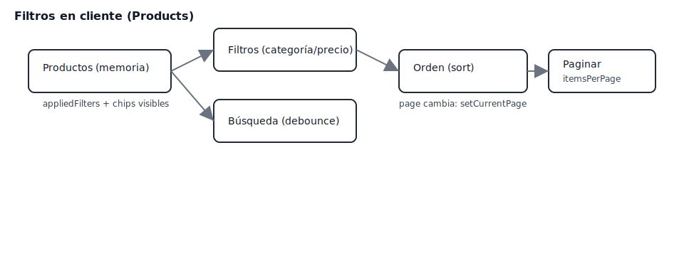

Puntos claves:
- Búsqueda con debounce.
- `useProductFilters` aplica filtros, ordena y pagina en memoria.
- `Pagination` usa `paginationInfo`.

---

## Layout + Grid responsivo

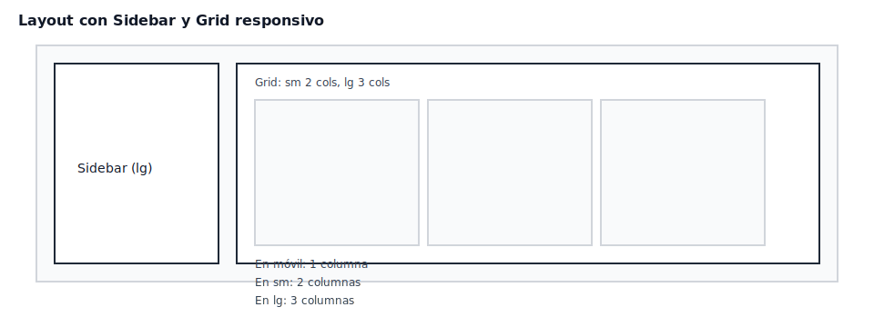

Tips:
- Sidebar fijo en `lg`.
- Grid 1→2→3 columnas con breakpoints Tailwind.

---

## Ciclo de query (react-query-lite)

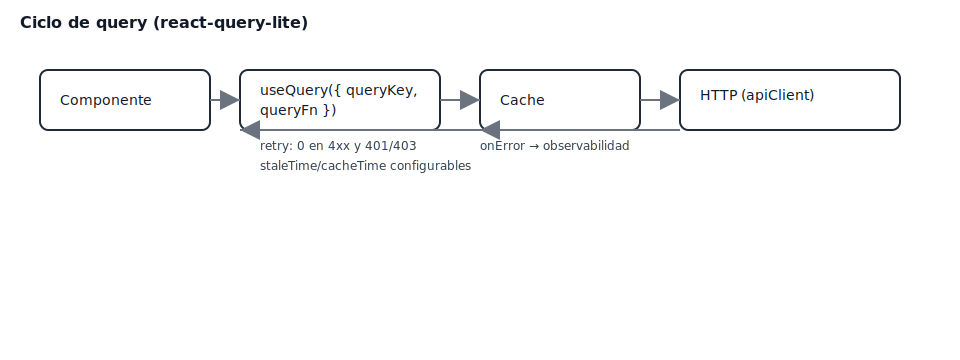

Claves:
- `staleTime` y `cacheTime`.
- `retry` evita 4xx y 401/403.
- `onError` → observabilidad.

---

## Optimistic update (Wishlist)

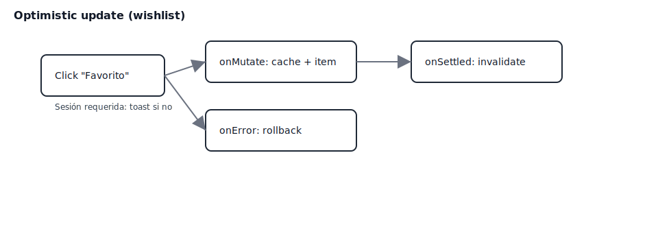

Flujo:
- `onMutate` actualiza cache al vuelo.
- `onSettled` invalida para sincronizar.
- `onError` hace rollback.

---

## Extra: Export CSV de órdenes

Pasos rápidos:
1. Endpoint: `GET /admin/pedidos/export?format=csv`.
2. Service: `ordersAdminApi.exportOrders(params, 'csv')` con `responseType:'blob'`.
3. UI: crear URL del blob y descargar.

---

## Referencias

- Guía completa: `docs/GUIA_SIMPLE_MOA.md`
- Anexo (errores/decisiones): `docs/ANEXO_ERRORES_DECISIONES.md`

---

## ¿Prof evaluando?

- Prepárate para explicar cliente vs servidor en filtros.
- Cuenta por qué se partió `react-query-lite` entre core compartido y wrappers React.
- Explica `server.fs.allow` para importar desde `../shared` en Vite dev.

---

## Auth/Login y rutas protegidas

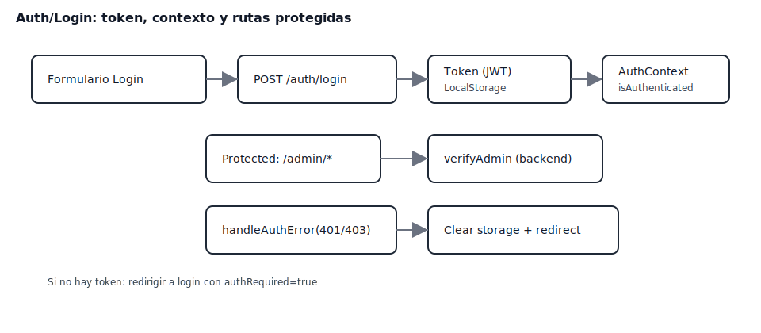

Claves:
- Token en storage y `AuthContext` con `isAuthenticated`.
- `verifyAdmin` protege `/admin/*` en backend.
- `handleAuthError` limpia y redirige en 401/403.

---

## Carrito end-to-end

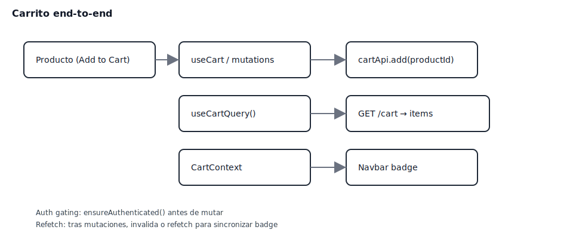

Notas:
- `ensureAuthenticated` antes de mutar.
- `useCartQuery` + refetch/invalidate sincronizan el badge.

---

## Búsqueda Products: URL y estado

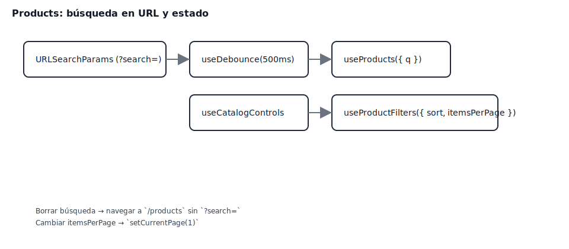

Puntos:
- `URLSearchParams` + debounce.
- Cambiar `itemsPerPage` resetea página.

---

## Admin: actualizar estado orden

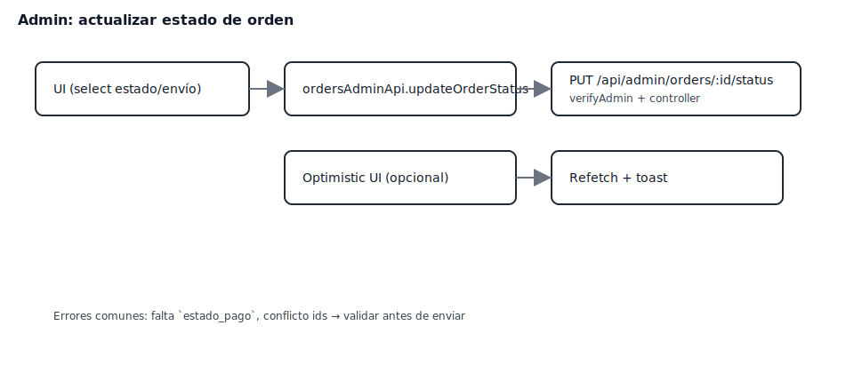

Pasos:
- PUT `/api/admin/orders/:id/status`.
- Refetch + toast; validaciones previas.

---

## Export CSV UX

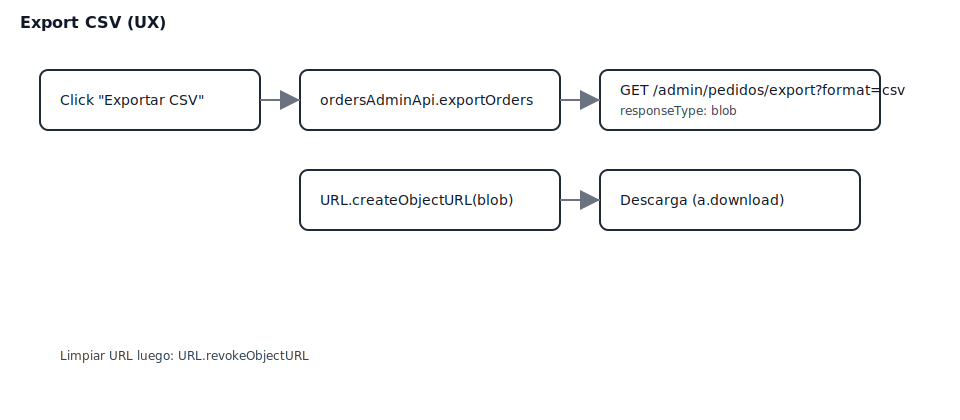

Checklist:
- `responseType:'blob'`.
- `URL.createObjectURL` → download → `revokeObjectURL`.

---

## Errores y observabilidad

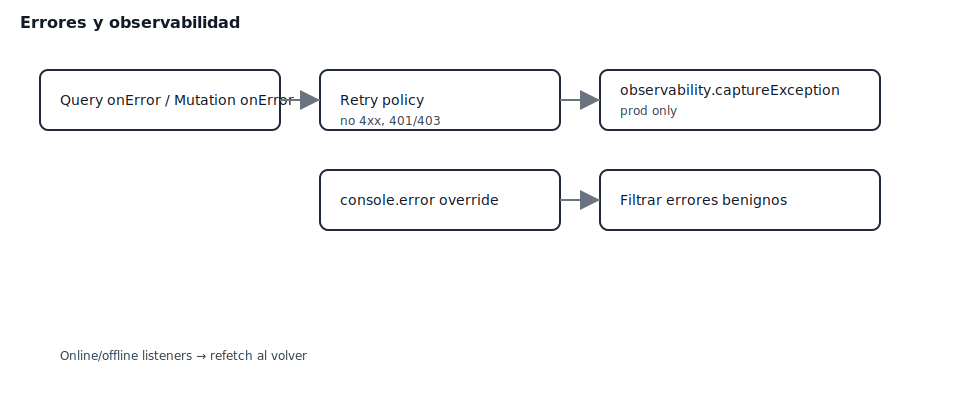

Resumen:
- `onError` y `retry` responsables.
- `console.error` filtrado en prod + captura a observabilidad.
